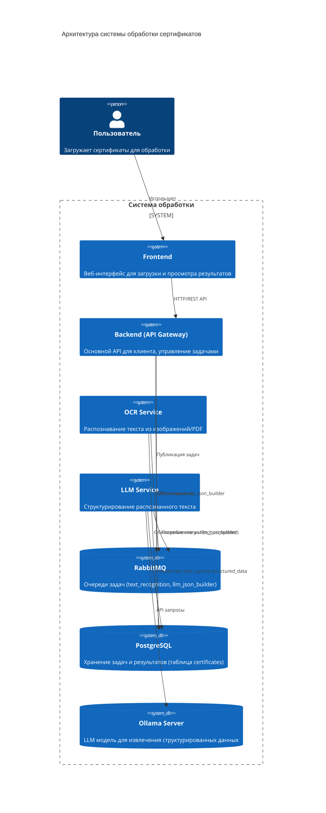
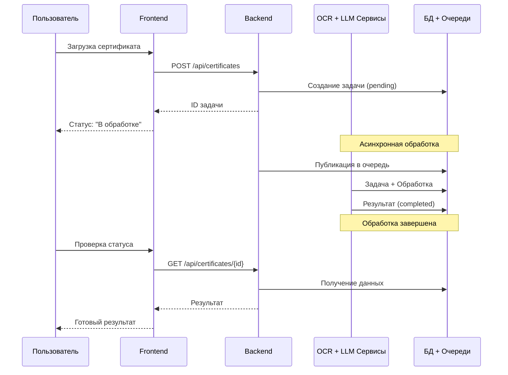

# Архитектура системы OCR/LLM обработки сертификатов

## Общая схема архитектуры



## Схема взаимодействия (упрощённая)



## Компоненты системы

### 1. Frontend
- **Назначение:** Веб-интерфейс для пользователей
- **Функции:**
  - Загрузка файлов (изображения, PDF)
  - Отображение статуса обработки
  - Просмотр результатов (raw_text, structured_data)
  - Управление задачами (список, фильтрация)

### 2. Backend (API Gateway)
- **Назначение:** Основной API для клиента
- **Функции:**
  - REST API для frontend
  - Валидация входящих данных
  - Создание задач в БД
  - Публикация задач в RabbitMQ
  - Отдача результатов обработки
  - Аутентификация/авторизация (при необходимости)

### 3. OCR Service
- **Назначение:** Распознавание текста из изображений/PDF
- **Технологии:** PaddleOCR-VL-1.5, PyMuPDF
- **Функции:**
  - Потребление задач из очереди `text_recognition`
  - Загрузка изображения из БД
  - OCR обработка моделью
  - Обновление статуса в БД
  - Публикация задачи в очередь `llm_json_builder`

### 4. LLM Service
- **Назначение:** Структурирование распознанного текста
- **Технологии:** Ollama API, LLM модель
- **Функции:**
  - Потребление задач из очереди `llm_json_builder`
  - Загрузка raw_text из БД
  - Запрос к Ollama для извлечения данных
  - Сохранение structured_data в БД

### 5. RabbitMQ
- **Назначение:** Асинхронная очередь задач
- **Очереди:**
  - `text_recognition` — задачи на OCR обработку
  - `llm_json_builder` — задачи на структурирование
- **Настройки:** prefetch_count=1 (одна задача за раз)

### 6. PostgreSQL
- **Назначение:** Хранение задач и результатов
- **Таблица:** `certificates`
- **Данные:**
  - Бинарные файлы (image_data)
  - Распознанный текст (raw_text)
  - Структурированные данные (structured_data JSONB)
  - Статусы обработки

### 7. Ollama Server
- **Назначение:** Хостинг LLM модели
- **Модель:** qwen3-coder:480b-cloud (или другая)
- **API:** `POST /api/chat`

## Поток данных

```
┌─────────────┐
│   User      │
└──────┬──────┘
       │ 1. Загрузка файла
       ▼
┌─────────────┐
│  Frontend   │
└──────┬──────┘
       │ 2. POST /api/certificates
       ▼
┌─────────────┐     3. INSERT task    ┌─────────────┐
│   Backend   │──────────────────────▶│ PostgreSQL  │
│ (API Gateway)│◀─────────────────────┤  (pending)  │
└──────┬──────┘     4. task id        └─────────────┘
       │
       │ 5. Publish {id}
       ▼
┌─────────────┐
│  RabbitMQ   │
│ text_       │
│ recognition │
└──────┬──────┘
       │ 6. Consume
       ▼
┌─────────────┐     7. SELECT image   ┌─────────────┐
│ OCR Service │──────────────────────▶│ PostgreSQL  │
└──────┬──────┘◀──────────────────────┤ image_data  │
       │       8. raw_text            └─────────────┘
       │
       │ 9. UPDATE ocr_completed
       │ 10. Publish {id}
       ▼
┌─────────────┐
│  RabbitMQ   │
│ llm_json_   │
│ builder     │
└──────┬──────┘
       │ 11. Consume
       ▼
┌─────────────┐     12. SELECT raw_text ┌─────────────┐
│ LLM Service │────────────────────────▶│ PostgreSQL  │
└──────┬──────┘◀────────────────────────┤             │
       │       13. structured_data      └─────────────┘
       │
       │ 14. POST /api/chat
       ▼
┌─────────────┐
│   Ollama    │
│   Server    │
└─────────────┘
```

## Статусы задачи

```
┌─────────┐
│ pending │
└────┬────┘
     │ (Backend публикует в text_recognition)
     ▼
┌────────────────┐
│ ocr_processing │
└───────┬────────┘
        │
     ┌──┴──┐
     │     │
     ▼     ▼
┌─────────────┐   ┌───────────┐
│ocr_completed│   │ ocr_error │
└──────┬──────┘   └───────────┘
       │ (OCR публикует в llm_json_builder)
       ▼
┌────────────────┐
│ llm_processing │
└───────┬────────┘
        │
     ┌──┴──┐
     │     │
     ▼     ▼
┌───────────┐   ┌───────┐
│ completed │   │ error │
└───────────┘   └───────┘
```

## API Endpoints (Backend)

| Метод | Endpoint | Описание |
|-------|----------|----------|
| POST | `/api/certificates` | Загрузка нового сертификата |
| GET | `/api/certificates` | Список всех задач (с фильтрацией) |
| GET | `/api/certificates/{id}` | Детали задачи по ID |
| GET | `/api/certificates/{id}/result` | Результат обработки (raw_text + structured_data) |
| DELETE | `/api/certificates/{id}` | Удаление задачи |
